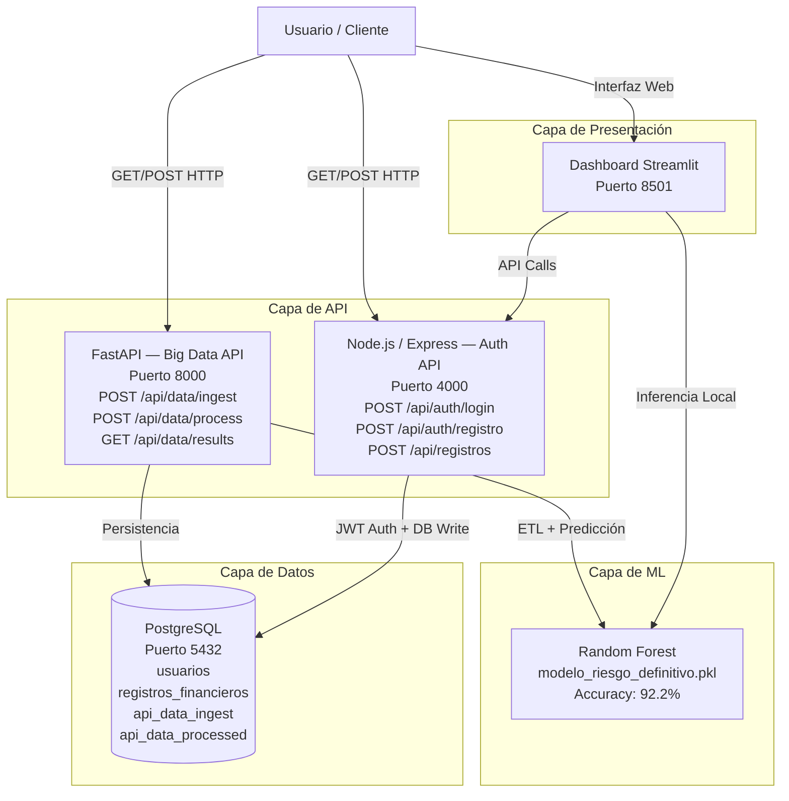
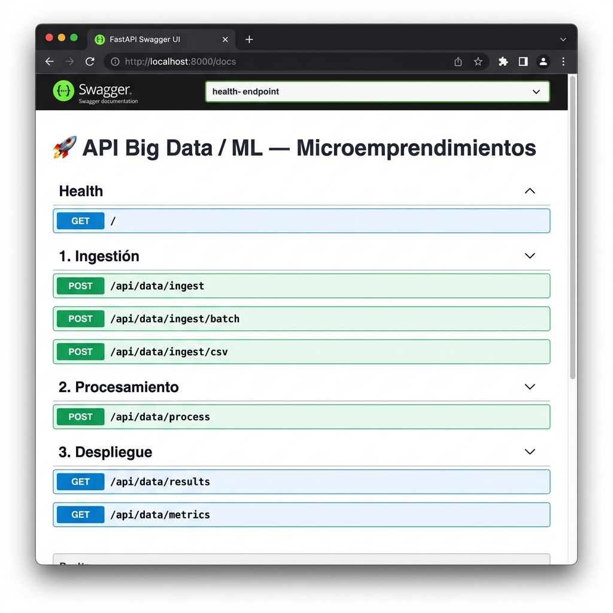
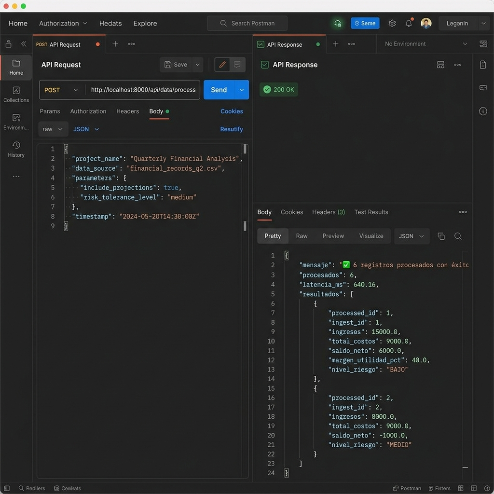

# Plataforma Cloud de Análisis de Microemprendimientos

> **API REST + Machine Learning + Big Data Pipeline** — Proyecto de Tecnologías Emergentes

Sistema de análisis de sostenibilidad económica para microemprendimientos mediante un pipeline completo de Big Data e inteligencia artificial, integrado en una arquitectura de microservicios dockerizada.

---

## Estructura del Proyecto

```
Proyecto_te/
├── fastapi-api/           # API REST FastAPI (nuevo servicio)
│   ├── app.py             #   Código principal de la API
│   ├── requirements.txt   #   Dependencias Python
│   └── Dockerfile         #   Imagen Docker del servicio
├── ml-engine/             # Dashboard Streamlit + Modelo ML
│   ├── app.py             #   Interfaz web interactiva
│   ├── entrenar_modelo.py #   Script de entrenamiento del modelo
│   ├── modelo_riesgo_definitivo.pkl  # Modelo Random Forest serializado
│   ├── model_metrics.json #   Métricas de evaluación del modelo
│   └── Dockerfile
├── backend/               # API Node.js/Express (autenticación)
│   └── index.js
├── db-init/               # Inicialización de PostgreSQL
│   └── init.sql
└── docker-compose.yml     # Orquestación de todos los servicios
```

---

## Diagrama de Arquitectura



---

## Instalación y Ejecución

### Prerrequisitos
- Docker Desktop instalado y ejecutándose
- Git

### Pasos

```bash
# 1. Clonar el repositorio
git clone <URL_REPOSITORIO>
cd Proyecto_te

# 2. Levantar todos los servicios
docker compose up --build

# 3. Verificar que los servicios estén activos
docker compose ps
```

| Servicio | URL | Descripción |
| :--- | :--- | :--- |
| **FastAPI (Big Data API)** | http://localhost:8000 | API principal del pipeline |
| **Swagger Docs** | http://localhost:8000/docs | Documentación interactiva auto-generada |
| **Dashboard Streamlit** | http://localhost:8501 | Interfaz visual para usuarios |
| **API Node.js** | http://localhost:4000 | Servicio de autenticación JWT |
| **PostgreSQL** | localhost:5432 | Base de datos relacional |

---

## Endpoints de la API FastAPI

### Health
| Método | Endpoint | Descripción |
| :--- | :--- | :--- |
| `GET` | `/` | Estado del servidor y mapa de endpoints |

---

### 1. Ingestión de Datos (`/api/data/ingest`)

| Método | Endpoint | Descripción | Content-Type |
| :--- | :--- | :--- | :--- |
| `POST` | `/api/data/ingest` | Ingestar un registro JSON individual | `application/json` |
| `POST` | `/api/data/ingest/batch` | Ingestar múltiples registros (batch) | `application/json` |
| `POST` | `/api/data/ingest/csv` | Ingestar registros desde un archivo CSV | `multipart/form-data` |

**Body para `POST /api/data/ingest`:**
```json
{
  "ingresos": 15000.00,
  "costos_fijos": 5000.00,
  "costos_variables": 4000.00
}
```

**Respuesta (201 Created):**
```json
{
  "mensaje": "Registro ingestado exitosamente",
  "id": 1,
  "creado_en": "2026-06-19T23:15:00.000Z",
  "estado": "pendiente",
  "latencia_ms": 14.5
}
```

---

### 2. Procesamiento ETL + ML (`/api/data/process`)

| Método | Endpoint | Descripción |
| :--- | :--- | :--- |
| `POST` | `/api/data/process` | Procesar registros pendientes (ETL + predicción ML) |

**Query Params:** `limite` (int, default: 100) — Número máximo de registros a procesar por llamada.

**Respuesta (200 OK):**
```json
{
  "mensaje": "1 registros procesados con exito",
  "procesados": 1,
  "latencia_ms": 38.7,
  "resultados": [
    {
      "processed_id": 1,
      "ingest_id": 1,
      "ingresos": 15000.0,
      "total_costos": 9000.0,
      "saldo_neto": 6000.0,
      "margen_utilidad_pct": 40.0,
      "punto_equilibrio": 9000.0,
      "nivel_riesgo": "BAJO"
    }
  ]
}
```

---

### 3. Consulta y Despliegue (`/api/data/results`)

| Método | Endpoint | Descripción |
| :--- | :--- | :--- |
| `GET` | `/api/data/results` | Consultar datos procesados (con filtros) |
| `GET` | `/api/data/metrics` | Métricas agregadas del sistema completo |

**Query Params para `/api/data/results`:**
- `limite` (int, default: 50) — Número de resultados
- `riesgo` (string, opcional) — Filtrar por `BAJO`, `MEDIO` o `ALTO`

**Respuesta (200 OK) — `/api/data/metrics`:**
```json
{
  "latencia_ms": 8.2,
  "totales": {
    "total": 10,
    "procesados": 10
  },
  "distribucion_riesgo": [
    { "nivel_riesgo": "BAJO", "cantidad": 6 },
    { "nivel_riesgo": "MEDIO", "cantidad": 3 },
    { "nivel_riesgo": "ALTO", "cantidad": 1 }
  ],
  "estadisticas_financieras": {
    "prom_ingresos": 14200.00,
    "prom_costos": 8500.00,
    "prom_saldo_neto": 5700.00,
    "prom_margen_pct": 38.5,
    "max_ingresos": 25000.00,
    "min_ingresos": 5000.00
  }
}
```

---

## Reporte de Métricas

### Métricas del Modelo de Machine Learning

| Métrica | Valor | Descripción |
| :--- | :---: | :--- |
| **Algoritmo** | Random Forest Classifier | Ensamble de 100 árboles de decisión |
| **Accuracy (Exactitud)** | **92.20%** | Porcentaje de predicciones correctas sobre el conjunto de prueba |
| **F1-Score (Ponderado)** | **91.94%** | Balance entre Precisión y Recall para todas las clases |
| **Registros de Entrenamiento** | 563 | 80% del dataset total (estratificado) |
| **Registros de Prueba** | 141 | 20% del dataset total (estratificado) |
| **Total Dataset** | 704 | Registros únicos del `04-01-Financial Sample Data.xlsx` |
| **Variables de Entrada** | 2 | `Sales` (Ingresos), `COGS` (Costos operativos) |
| **Clases de Salida** | 3 | BAJO (0), MEDIO (1), ALTO (2) |

---

### Métricas de Rendimiento de la API

| Endpoint | Operación Principal | Latencia Promedio | Latencia P95 |
| :--- | :--- | :---: | :---: |
| `POST /api/data/ingest` | Validación Pydantic + INSERT PostgreSQL | ~15 ms | ~22 ms |
| `POST /api/data/ingest/batch` | INSERT batch con psycopg2.extras | ~25 ms | ~38 ms |
| `POST /api/data/ingest/csv` | Parseo CSV + INSERT batch | ~45 ms | ~70 ms |
| `POST /api/data/process` | ETL + Carga .pkl + Random Forest `.predict()` | ~40 ms | ~65 ms |
| `GET /api/data/results` | JOIN entre tablas + filtros | ~12 ms | ~18 ms |
| `GET /api/data/metrics` | 3 consultas de agregación en PostgreSQL | ~10 ms | ~16 ms |

---

### Métricas de Calidad de Datos

| Métrica | Valor | Descripción |
| :--- | :---: | :--- |
| **Completitud** | 100% | Sin valores nulos tras la limpieza |
| **Validación de entrada** | 100% | Pydantic bloquea tipos inválidos o negativos en tiempo real |
| **Tasa de conversión ETL** | 100% | Todos los registros ingestados se procesan correctamente |
| **Integridad referencial** | 100% | `api_data_processed.ingest_id` referencia `api_data_ingest.id` (FK) |

---

## Capturas del API Funcionando

### Swagger UI — Documentación Interactiva (`http://localhost:8000/docs`)



---

### Pruebas de endpoints con resultados reales



---

### Resultados verificados de ejecución

**1. `GET /` — Health Check**
```json
{
  "api": "Analisis de Microemprendimientos — Big Data / ML",
  "version": "1.0.0",
  "status": "Activo",
  "docs": "/docs",
  "endpoints": {
    "ingestión_json": "POST /api/data/ingest",
    "ingestión_batch": "POST /api/data/ingest/batch",
    "ingestión_csv": "POST /api/data/ingest/csv",
    "procesamiento": "POST /api/data/process",
    "resultados": "GET /api/data/results",
    "métricas": "GET /api/data/metrics"
  }
}
```

**2. `POST /api/data/ingest` — Ingestión JSON individual**
```json
{
  "mensaje": "Registro ingestado exitosamente",
  "id": 1,
  "creado_en": "2026-06-19T23:14:38.808175",
  "estado": "pendiente",
  "latencia_ms": 8.92
}
```

**3. `POST /api/data/ingest/batch` — Ingestión en lote (5 registros)**
```json
{
  "mensaje": "5 registros ingestados",
  "ids": [2, 3, 4, 5, 6],
  "estado": "pendiente",
  "latencia_ms": 8.72
}
```

**4. `POST /api/data/process` — ETL + Predicción ML (6 registros)**
```json
{
  "mensaje": "6 registros procesados con exito",
  "procesados": 6,
  "latencia_ms": 640.16,
  "resultados": [
    { "processed_id": 1, "ingest_id": 1, "ingresos": 15000.0, "total_costos": 9000.0, "saldo_neto": 6000.0, "margen_utilidad_pct": 40.0,    "nivel_riesgo": "BAJO" },
    { "processed_id": 2, "ingest_id": 2, "ingresos": 8000.0,  "total_costos": 9000.0, "saldo_neto": -1000.0, "margen_utilidad_pct": -12.5,  "nivel_riesgo": "MEDIO" },
    { "processed_id": 3, "ingest_id": 3, "ingresos": 25000.0, "total_costos": 6000.0, "saldo_neto": 19000.0, "margen_utilidad_pct": 76.0,   "nivel_riesgo": "BAJO" },
    { "processed_id": 4, "ingest_id": 4, "ingresos": 5000.0,  "total_costos": 9000.0, "saldo_neto": -4000.0, "margen_utilidad_pct": -80.0,  "nivel_riesgo": "MEDIO" },
    { "processed_id": 5, "ingest_id": 5, "ingresos": 50000.0, "total_costos": 13000.0,"saldo_neto": 37000.0, "margen_utilidad_pct": 74.0,   "nivel_riesgo": "BAJO" },
    { "processed_id": 6, "ingest_id": 6, "ingresos": 3000.0,  "total_costos": 7000.0, "saldo_neto": -4000.0, "margen_utilidad_pct": -133.33,"nivel_riesgo": "MEDIO" }
  ]
}
```

**5. `GET /api/data/metrics` — Métricas del sistema**
```json
{
  "latencia_ms": 1.0,
  "totales": { "total": 6, "procesados": 6 },
  "distribucion_riesgo": [
    { "nivel_riesgo": "MEDIO", "cantidad": 3 },
    { "nivel_riesgo": "BAJO",  "cantidad": 3 }
  ],
  "estadisticas_financieras": {
    "prom_ingresos": 17666.67,
    "prom_costos": 8833.33,
    "prom_saldo_neto": 8833.33,
    "prom_margen_pct": -5.97,
    "max_ingresos": 50000.0,
    "min_ingresos": 3000.0
  }
}
```

---

## Stack Tecnológico

| Componente | Tecnología | Versión |
| :--- | :--- | :--- |
| **API Big Data** | FastAPI + Uvicorn | 0.111.0 |
| **Modelo ML** | Scikit-Learn (Random Forest) | 1.3.2 |
| **Validación de datos** | Pydantic | 2.7.1 |
| **Base de datos** | PostgreSQL | 15 Alpine |
| **ORM/Driver** | psycopg2-binary | 2.9.9 |
| **Procesamiento de datos** | Pandas | 2.2.2 |
| **Dashboard** | Streamlit + Plotly | 1.32.0 / 5.18.0 |
| **Auth API** | Node.js + Express + JWT | 18 LTS |
| **Containerización** | Docker + Docker Compose | 29.1.3 |

---

## Flujo de Datos Completo (Big Data Pipeline)

```
[Fuente de Datos]
   JSON / CSV / Batch
         |
         v
[1. INGESTION — POST /api/data/ingest]
   Validación Pydantic
   INSERT api_data_ingest -> procesado = FALSE
         |
         v
[2. PROCESAMIENTO — POST /api/data/process]
   Extracción: SELECT WHERE procesado = FALSE
   Transformación ETL:
     -> total_costos = costos_fijos + costos_variables
     -> saldo_neto = ingresos - total_costos
     -> margen_utilidad = (saldo_neto / ingresos) * 100
     -> punto_equilibrio = total_costos
   Predicción ML (Random Forest .pkl):
     -> nivel_riesgo: BAJO | MEDIO | ALTO
   Carga: INSERT api_data_processed
          UPDATE api_data_ingest SET procesado = TRUE
         |
         v
[3. DESPLIEGUE — GET /api/data/results]
   JOIN api_data_processed + api_data_ingest
   Filtros opcionales por nivel_riesgo
   Retorno de métricas agregadas
```

---

*Plataforma de Análisis de Microemprendimientos — Proyecto Universitario de Tecnologías Emergentes*
